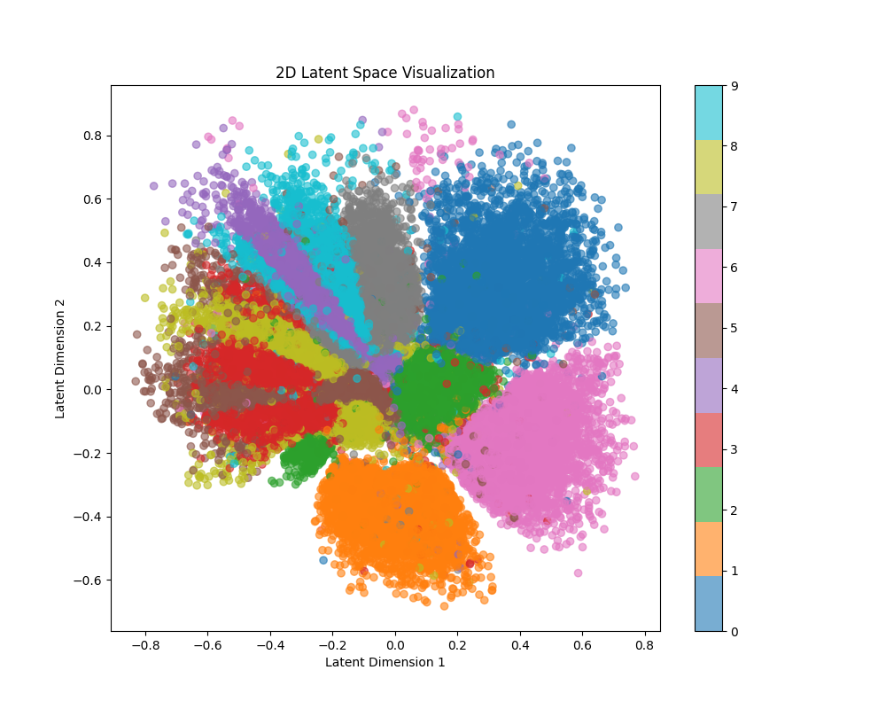
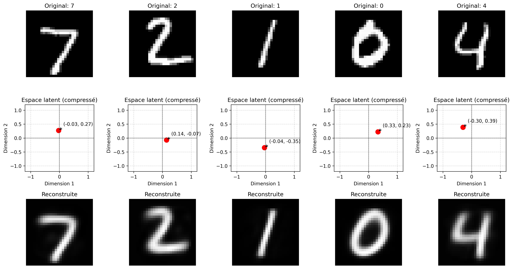
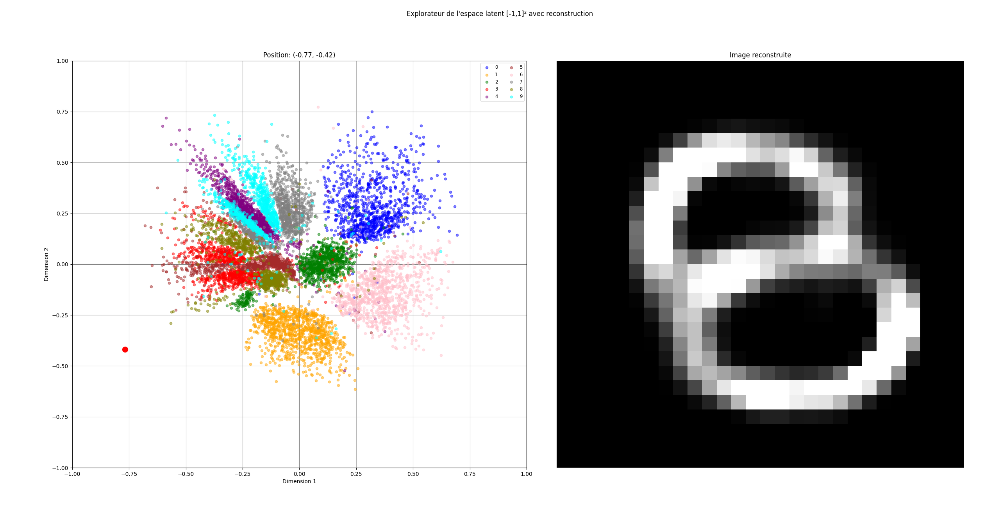

# Latent Space MNIST Explorer 🇺🇸 🇬🇧 / Explorateur d'Espace Latent MNIST 🇫🇷

## English 🇺🇸 🇬🇧

### Description

This repository contains a neural network-based autoencoder project that compresses MNIST handwritten digits into a 2D latent space and provides an interactive visualization tool. The project demonstrates dimensionality reduction, feature learning, and image reconstruction using PyTorch.

### Components

- **`main.py`**: Implements the autoencoder architecture, training procedure, and basic visualizations. The neural network compresses 784-dimensional images (28x28 pixels) into a 2-dimensional latent space.
- **`interac_decompression.py`**: Interactive visualization tool that allows you to:
  - Explore the latent space by clicking or dragging a point.
  - See the corresponding reconstructed digit in real-time.
  - Observe how different digits are distributed in the latent space.
- **`view_ml_compressed.py`**: Creates 3D density visualizations of the latent space for specific digits, showing the probability distribution of latent representations.

### Features

- Highly compressed representation (784 → 2 dimensions, 392x compression ratio).
- Batch normalization for faster, more stable training.
- Interactive latent space exploration.
- 3D density visualization.
- Checkpoint management for resuming training.

### Screenshots

-  The 2D latent space showing how different digits cluster in the compressed representation.
-  Comparison between original MNIST digits (top) and their reconstructions (bottom) after compression.
-  3D density visualization showing the distribution of a specific digit in latent space.
-  The interactive latent space explorer allowing real-time digit generation.

### Requirements

- `PyTorch`
- `torchvision`
- `matplotlib`
- `numpy`
- `scipy`

### Usage

**Train the autoencoder:**

```bash
python main.py --epochs 600
```

**Resume training from a checkpoint:**

```bash
python main.py --resume checkpoints/autoencoder_epoch_100.pth --epochs 600 --start_epoch 100
```

**Explore the latent space interactively:**

```bash
python interac_decompression.py
```

**Generate 3D density visualizations for a specific digit:**

```bash
python view_ml_compressed.py
```

### How It Works

The autoencoder network compresses input images through a series of layers that gradually reduce dimensionality to just 2 dimensions. These 2 dimensions capture the essential features needed to reconstruct the original digits. The decoder network then expands these 2 dimensions back to the original 784 pixels.

The latent space has meaningful organization - similar digits tend to cluster together, and the space between digits often produces interesting hybrid reconstructions when sampled.

---

## Français 🇫🇷

### Description

Ce dépôt contient un projet d'auto-encodeur basé sur un réseau de neurones qui compresse les chiffres manuscrits MNIST dans un espace latent 2D et fournit un outil de visualisation interactif. Le projet démontre la réduction de dimensionnalité, l'apprentissage de caractéristiques et la reconstruction d'images à l'aide de PyTorch.

### Composants

- **`main.py`** : Implémente l'architecture de l'auto-encodeur, la procédure d'entraînement et les visualisations de base. Le réseau de neurones compresse des images de 784 dimensions (28x28 pixels) en un espace latent de 2 dimensions.
- **`interac_decompression.py`** : Outil de visualisation interactif qui permet de :
  - Explorer l'espace latent en cliquant ou en faisant glisser un point.
  - Voir le chiffre reconstruit correspondant en temps réel.
  - Observer comment différents chiffres sont distribués dans l'espace latent.
- **`view_ml_compressed.py`** : Crée des visualisations de densité 3D de l'espace latent pour des chiffres spécifiques, montrant la distribution de probabilité des représentations latentes.

### Captures d'écran

-  L'espace latent 2D montrant comment différents chiffres se regroupent dans la représentation compressée.
-  Comparaison entre les chiffres MNIST originaux (en haut) et leurs reconstructions (en bas) après compression.
-  Visualisation de densité 3D montrant la distribution d'un chiffre spécifique dans l'espace latent.
-  L'explorateur d'espace latent interactif permettant la génération de chiffres en temps réel.

### Caractéristiques

- Représentation hautement compressée (784 → 2 dimensions, taux de compression de 392x).
- Normalisation par lots pour un entraînement plus rapide et plus stable.
- Exploration interactive de l'espace latent.
- Visualisation de densité 3D.
- Gestion des points de contrôle pour reprendre l'entraînement.

### Prérequis

- `PyTorch`
- `torchvision`
- `matplotlib`
- `numpy`
- `scipy`

### Utilisation

**Entraîner l'auto-encodeur :**

```bash
python main.py --epochs 600
```

**Reprendre l'entraînement à partir d'un point de contrôle :**

```bash
python main.py --resume checkpoints/autoencoder_epoch_100.pth --epochs 600 --start_epoch 100
```

**Explorer l'espace latent de manière interactive :**

```bash
python interac_decompression.py
```

**Générer des visualisations de densité 3D pour un chiffre spécifique :**

```bash
python view_ml_compressed.py
```

### Comment ça fonctionne

Le réseau auto-encodeur compresse les images d'entrée à travers une série de couches qui réduisent progressivement la dimensionnalité à seulement 2 dimensions. Ces 2 dimensions capturent les caractéristiques essentielles nécessaires pour reconstruire les chiffres originaux. Le réseau décodeur étend ensuite ces 2 dimensions pour revenir aux 784 pixels d'origine.

L'espace latent présente une organisation significative - les chiffres similaires ont tendance à se regrouper, et l'espace entre les chiffres produit souvent des reconstructions hybrides intéressantes lorsqu'il est échantillonné.
