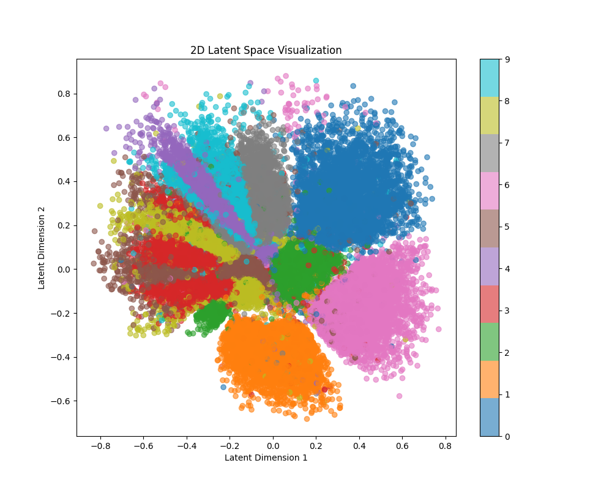
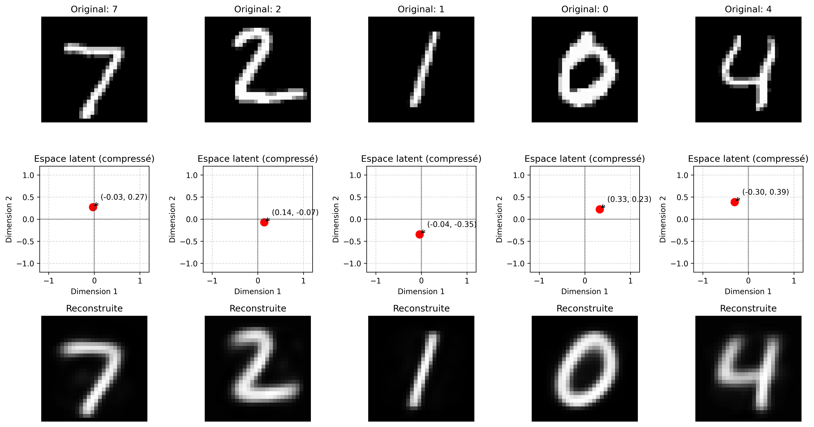
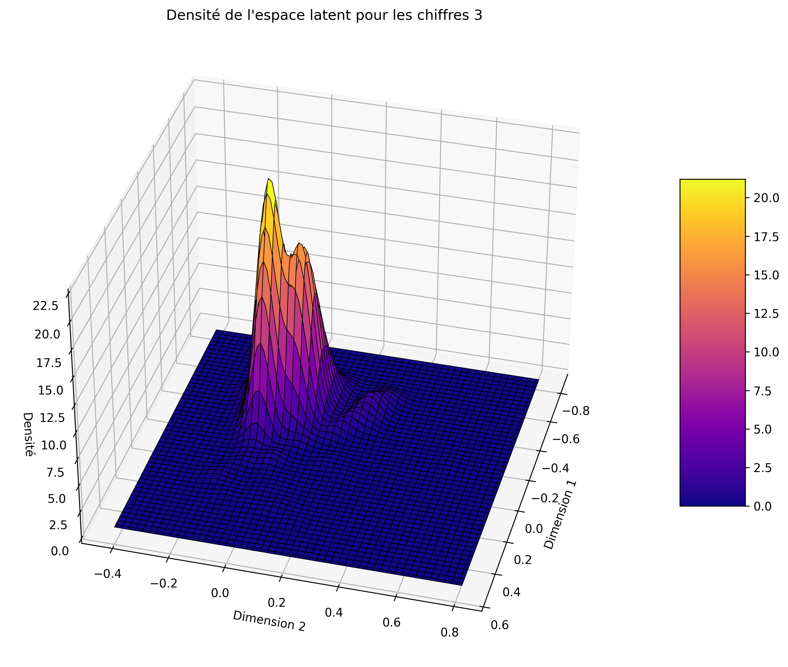
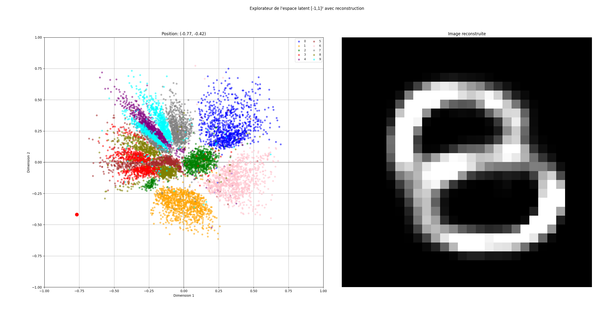

# Latent Space MNIST Explorer 🇺🇸 🇬🇧 / Explorateur d'Espace Latent MNIST 🇫🇷

Autoencodeur MNIST → espace latent **2D** (compression 392×). Le projet existe en **deux versions** : la version PyTorch d'origine et une réimplémentation MLX qui bat le baseline PyTorch en moins d'une minute sur Apple Silicon.

---

## TL;DR — Benchmark PyTorch vs MLX

| Implémentation | Architecture | Params | Test MSE | Temps pour battre PyTorch |
|---|---|---|---|---|
| **PyTorch** (référence) | MLP + BatchNorm | 1.16M | 0.03088 | — (entraîné 600 epochs) |
| **MLX β-VAE** | MLP asymétrique + LayerNorm | 6.8M | **0.02907** (-5.9 %) | **49s / 270 epochs** |

Mesures sur Mac M5 Max, 64 Go de RAM unifiée, MLX 0.31 (Metal).

---

## English 🇺🇸 🇬🇧

### Description

This repository compresses MNIST handwritten digits into a 2-dimensional latent space and provides interactive visualization tools. It exists in two implementations:

- **PyTorch** (`main.py`, original): an MLP autoencoder trained for 600 epochs.
- **MLX** (`main_mlx.py`): a re-implementation in Apple's MLX framework using a β-VAE with an asymmetric MLP, that beats the PyTorch baseline by ~6 % MSE in under 1 minute of training on a Mac M5 Max.

### File map

| File | Purpose |
|---|---|
| `main.py` | PyTorch autoencoder + training |
| `main_mlx.py` | MLX β-VAE + training (BCE/MSE/SSIM losses, cosine warm restarts, bf16 option) |
| `bench_torch.py` | Measures PyTorch test MSE → reference number to beat |
| `interac_decompression.py` | Interactive latent-space explorer (PyTorch model) |
| `interac_decompression_mlx.py` | Same explorer, loads the MLX checkpoint |
| `view_ml_compressed.py` | Full 70k-sample latent-space map (PyTorch) |
| `compare_recon.py` | Side-by-side: original / PyTorch recon / MLX recon |

### Setup (uv)

```bash
uv sync          # creates .venv and installs torch + mlx + matplotlib
```

`pyproject.toml` pins Python 3.13 (mlx-data wheel constraint) and includes both `torch` and `mlx` so the same env runs both implementations.

### Usage

**Measure the PyTorch baseline:**
```bash
uv run python bench_torch.py
# → PyTorch baseline | test MSE = 0.03087685 | 823.5 ms
```

**Train the MLX β-VAE (default config = the one that beats PyTorch):**
```bash
uv run python main_mlx.py --epochs 4000 --lr 1.5e-3 --batch 1024 --cycles 4
```
Logs the epoch + wall-time at which the PyTorch MSE is beaten, saves the best checkpoint to `checkpoints/mlx_best.safetensors` (in fp32 for direct loading).

**Train the original PyTorch model:**
```bash
uv run python main.py --epochs 600
```

**Interactive latent-space explorers:**
```bash
uv run python interac_decompression.py        # PyTorch model
uv run python interac_decompression_mlx.py    # MLX β-VAE
```

**Visual side-by-side comparison:**
```bash
uv run python compare_recon.py
# → img/comparaison/torch_vs_mlx.png
```

### Key MLX design choices

These are the patterns that actually worked (others were tried and rejected):

- **β-VAE with very small β** (1e-4): the stochastic bottleneck breaks the mode-collapse problem we hit with deterministic AEs ("decoder learns the per-pixel mean and ignores z").
- **Asymmetric MLP**: the decoder is wider than the encoder. The decoder must "imagine" 28×28 pixels from 2 numbers — that's where the capacity should be.
- **LayerNorm + Kaiming init + small init (std=0.01) on the latent layer**: prevents Tanh saturation that kills gradients in the encoder. With BatchNorm + `mx.compile`, we hit a mode collapse to MSE = 0.067 (= per-pixel variance of MNIST).
- **AdamW + cosine warm-restart schedule** (3-4 cycles): helps escape local minima.
- **Default batch = 1024**: bigger batches (4096+) are faster per epoch but converge worse in wall-clock to a target MSE.

### What we tried and what we kept

| Variant | Result |
|---|---|
| MLP + MSE | 0.0294 (good baseline) |
| MLP + BCE loss | 0.0301 (slightly worse) |
| Conv with FiLM injection | ~0.035 (mode collapse hard to control) |
| **β-VAE asymmetric MLP** | **0.0291** ← best |
| Denoising VAE (noise=0.15) | 0.0302 (noise too aggressive) |
| MSE + SSIM (50/50) | 0.031 (SSIM hurts pure MSE) |
| bf16 mixed precision | 0.0316 (Adam loses precision on small gradients) |

### Theoretical floor

For a non-autoregressive autoencoder at `latent_dim=2`, MNIST's intrinsic dimension (~8-14) sets a hard floor around **0.018-0.022 test MSE**. To get below 0.025, you typically need an autoregressive decoder (PixelCNN-style), perceptual losses, or skip connections (which defeat the bottleneck). Our 0.029 is close to the ceiling for this class of architectures.

---

## Français 🇫🇷

### Description

Ce dépôt compresse les chiffres manuscrits MNIST dans un espace latent 2D et fournit des outils de visualisation interactifs. Il existe en deux implémentations :

- **PyTorch** (`main.py`, version d'origine) : un autoencodeur MLP entraîné 600 epochs.
- **MLX** (`main_mlx.py`) : une réimplémentation en MLX (le framework ML d'Apple pour Apple Silicon) basée sur un β-VAE avec MLP asymétrique. Elle bat la référence PyTorch d'environ 6 % de MSE en moins d'une minute d'entraînement sur Mac M5 Max.

### Carte des fichiers

| Fichier | Rôle |
|---|---|
| `main.py` | Autoencodeur PyTorch + entraînement |
| `main_mlx.py` | β-VAE MLX + entraînement (BCE/MSE/SSIM, cosine warm restarts, option bf16) |
| `bench_torch.py` | Mesure la MSE test PyTorch → cible à battre |
| `interac_decompression.py` | Explorateur interactif de l'espace latent (modèle PyTorch) |
| `interac_decompression_mlx.py` | Même explorateur, charge le checkpoint MLX |
| `view_ml_compressed.py` | Carte complète des 70k samples dans l'espace latent (PyTorch) |
| `compare_recon.py` | Comparaison côte-à-côte : original / recon PyTorch / recon MLX |

### Installation (uv)

```bash
uv sync          # crée .venv et installe torch + mlx + matplotlib
```

Le `pyproject.toml` pin Python 3.13 (contrainte du wheel mlx-data) et inclut `torch` et `mlx` dans le même env, donc les deux implémentations tournent sans switch.

### Utilisation

**Mesurer la référence PyTorch :**
```bash
uv run python bench_torch.py
# → PyTorch baseline | test MSE = 0.03087685 | 823.5 ms
```

**Entraîner le β-VAE MLX (config par défaut = celle qui bat PyTorch) :**
```bash
uv run python main_mlx.py --epochs 4000 --lr 1.5e-3 --batch 1024 --cycles 4
```
Logue l'epoch + le temps où la MSE PyTorch est dépassée, sauve le meilleur checkpoint dans `checkpoints/mlx_best.safetensors` (en fp32 pour chargement direct).

**Entraîner le modèle PyTorch d'origine :**
```bash
uv run python main.py --epochs 600
```

**Explorateurs interactifs :**
```bash
uv run python interac_decompression.py        # modèle PyTorch
uv run python interac_decompression_mlx.py    # β-VAE MLX
```

**Comparaison visuelle :**
```bash
uv run python compare_recon.py
# → img/comparaison/torch_vs_mlx.png
```

### Décisions clés du modèle MLX

Voici les choix qui ont vraiment fait converger le modèle (les autres ont été testés et écartés) :

- **β-VAE avec β très petit** (1e-4) : le bottleneck stochastique évite le mode collapse classique des AE déterministes ("le décodeur apprend la moyenne par pixel et ignore z").
- **MLP asymétrique** : le décodeur est plus large que l'encodeur. C'est lui qui doit "imaginer" 28×28 pixels à partir de 2 nombres — c'est là que la capacité doit être.
- **LayerNorm + init Kaiming + petite init (std=0.01) sur la couche latente** : évite la saturation immédiate de Tanh qui tuait le gradient de l'encodeur. Avec `BatchNorm + mx.compile`, on tombait sur un mode collapse à MSE = 0.067 (= variance pixel-wise de MNIST).
- **AdamW + cosine avec warm restarts** (3-4 cycles) : aide à sortir des minima locaux.
- **Batch = 1024 par défaut** : les batchs plus gros (4096+) sont plus rapides par epoch mais convergent moins vite en temps de paroi vers une MSE cible.

### Ce qu'on a essayé et ce qu'on a gardé

| Variante | Résultat |
|---|---|
| MLP + MSE | 0.0294 (bonne baseline) |
| MLP + BCE | 0.0301 (légèrement moins bon) |
| Conv avec injection FiLM | ~0.035 (mode collapse difficile à dompter) |
| **β-VAE MLP asymétrique** | **0.0291** ← meilleur |
| Denoising VAE (noise=0.15) | 0.0302 (bruit trop agressif) |
| MSE + SSIM (50/50) | 0.031 (SSIM nuit à la MSE pure) |
| Précision bf16 | 0.0316 (Adam perd en précision sur les petits gradients) |

### Plancher théorique

Pour un autoencodeur non-autoregressif à `latent_dim=2`, la dimension intrinsèque de MNIST (~8-14) pose un plancher dur autour de **0.018-0.022 de MSE test**. Pour passer sous 0.025, il faut typiquement un décodeur autoregressif (style PixelCNN), des pertes perceptuelles, ou des skip connections (qui contournent le bottleneck). Notre 0.029 est proche du plafond atteignable pour cette classe d'architectures.

### Captures d'écran

-  L'espace latent 2D : les chiffres similaires se regroupent dans la représentation compressée.
-  Originaux (haut) vs reconstructions (bas).
-  Densité 3D de la distribution d'un chiffre dans l'espace latent.
-  L'explorateur en temps réel.
